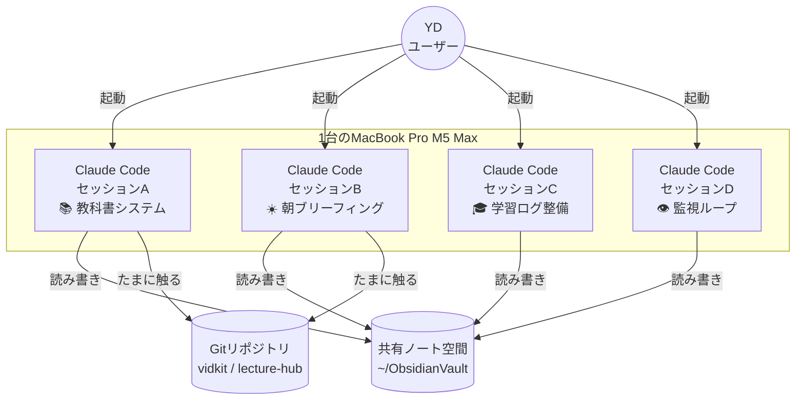
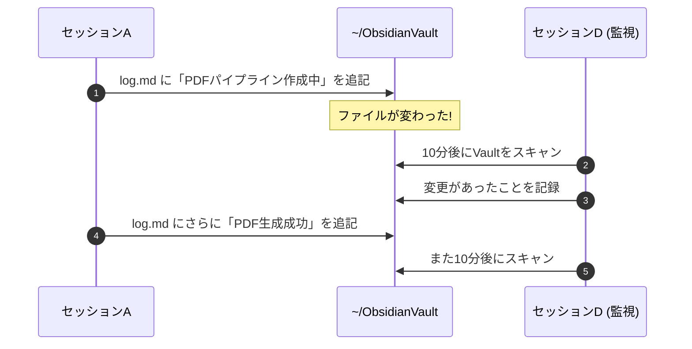

# Claude Code 4並列で何が起きてるか

## 1. 何が起きた?

2026-05-19の朝、YDのMacBook Proの画面が**4つのターミナル**で埋まった。
それぞれの画面には「Claude Code」というAIが動いていて、別々の仕事をしている。

- **セッションA** — この教科書システムを作っている (今これを書いている当人)
- **セッションB** — 毎朝のブリーフィングPDFを自動配信する仕組みを作っている
- **セッションC** — Anthropic Academyの学習ログ構造を整えている
- **セッションD** — Vaultの状況を10分おきに監視している (これは前日から動きっぱなし)

YDが思った素朴な疑問:

> 「これ全部、同じ1台のMacで同時に動いてるんだよね?
>  どうしてケンカしないの? 同じファイルを4人で書いたら壊れない?
>  そもそも *cron* って何? *git* って何が偉い?」

この章は、その疑問に**ターミナルすら怖い人向け**に答える。
読み終わると、4並列がどう動いているかが頭の中で絵になっているはず。

---

## 2. 図解 — 4人のClaudeはどこで会話しているか



*4つのセッションは1台のMacの中で並行して走る。会話の場所は「ノート空間」と「Gitリポジトリ」の2つ。*



*セッションDは「監視役」で、A/B/Cが書き残したログをずっと見ている。これが「監視ループ」。*

---

## 3. キーコンセプト (5つだけ覚える)

### 3.1 Claude Code とは「ターミナルで動くAI」

**Claude Code** とは、Anthropic社が公式に出している「ターミナル (黒い画面) で動くAI開発アシスタント」のこと。
スマホでChatGPTに話しかけるのと同じ感覚で、AIに「ファイル作って」「コード書いて」「commitして」と頼める。

違いは**手足を持っている**こと。普通のチャットAIは「やり方を教えてくれる」だけだが、
Claude Codeは「実際にファイルを書く・コマンドを実行する」までやってくれる。

> 用語: **ターミナル** = Macに最初から入っている「文字でコンピュータに命令する画面」。
> Launchpadで「ターミナル」と検索すると出てくる。黒い背景に白い文字。

### 3.2 「並列セッション」=「ターミナルを4つ開くだけ」

並列セッションといっても特殊な技術ではない。
**ターミナルウィンドウを4つ開いて、それぞれで `claude` コマンドを打つ**だけ。

```bash
# ターミナル1つ目を開いて
claude
# → セッションAが起動

# ターミナル2つ目を開いて (Cmd + N で新規ウィンドウ)
claude
# → セッションBが起動 (Aとは別物)
```

各セッションは**独立した会話**を持つ。AはBが今何をしているか直接は知らない。
お互いを知るには「共有のノートを残す」必要がある。それが次のポイント。

### 3.3 共有空間は `~/ObsidianVault/`

`~/ObsidianVault/` というフォルダがYDのMacにある。
ここに置かれた **`log.md`** や **`current_state/active_projects.md`** が「みんなが読むノート」になる。

```text
~/ObsidianVault/
├── log.md                       ← 全セッションがここに作業ログを追記
├── current_state/
│   └── active_projects.md       ← 進行中プロジェクトの最新状態
├── mistakes/
│   └── claude_mistakes.md       ← 過去のミス記録
└── decisions/
    └── 2026-05-19_*.md          ← 意思決定の記録
```

各セッションは作業開始時にこれらのファイルを読み、終了時に追記する。
これで「Aが何をやったか」をBが知ることができる。

> 用語: **`~`** (チルダ) = ホームディレクトリ。YDのMacでは `/Users/ittou/` のこと。
> `~/ObsidianVault/` = `/Users/ittou/ObsidianVault/` と同じ意味。

### 3.4 cron は「決まった時刻に勝手に動く仕組み」

セッションDは「監視ループ」と呼ばれていて、10分おきに自動で動いている。
これを支えているのが **cron** (クロン) というMac標準の仕組み。

cronに「毎日朝7:30に xxx を実行して」と登録しておくと、Macが勝手にやってくれる。
人間が手動でターミナルを開かなくていい。

```bash
# crontab に登録された例 (実物のイメージ)
# 分 時 日 月 曜日  実行するコマンド
*/10 * * * *  ~/scripts/vault_monitor.sh    # 10分おきに監視スクリプト実行
30 7 * * *    ~/scripts/morning_brief.sh    # 毎朝7:30に朝ブリーフィング配信
```

これでセッションD相当の処理が、YDが寝ている間も裏で動き続ける。

### 3.5 ファイル衝突は「Git」と「整理」で防ぐ

「4人が同じファイルを同時に書いたら壊れない?」という不安はもっとも。
答えは「**役割分担で衝突しないようにする**」 + 「**git で履歴を残す**」の二段構え。

- **役割分担**: セッションAは `textbook/`、セッションBは `briefing/`、と書く場所を最初から分ける
- **共有ファイル (log.md など) は追記専用**: 上書きしないルールにする
- **コードの変更はgitに記録**: 万が一衝突したら、git の履歴から元に戻せる

> 用語: **git** (ギット) = ファイルの変更履歴を全部記録するツール。
> 「いつ・誰が・何を変えたか」を分単位で記録してくれる。タイムマシン的なやつ。

---

## 4. コード解説 — 実際に動くコマンド

### 4.1 セッションを1つ起動する

```bash
# ターミナルを開いて、こう打つだけ
cd ~                      # ホームディレクトリに移動 (cd = change directory)
claude                    # Claude Code 起動。プロンプトが現れる
```

これだけで対話が始まる。
複数セッション欲しい時は、ターミナルウィンドウを `Cmd + N` で増やして同じことをするだけ。

### 4.2 各セッションに「あなたの担当はこれです」と伝える

セッションA/B/C/Dそれぞれに**最初に渡すミッション文**を変える。
これが「セッションの個性」になる。

例 (セッションAに渡したミッションの一部):

```text
# Mission: YD専用教科書システムを構築する (セッションA)

## やること
1. ~/ObsidianVault/textbook/ ディレクトリ構造作成
2. ~/projects/textbook-engine/ にPDF生成パイプライン構築
3. 統一テンプレート策定
4. 第1号「Claude Code 4並列で何が起きてるか」執筆
5. PDF生成 + 動作確認
6. Vault log への完了報告

## 自走モード
- エラーに遭遇したら3回まで自力で解決を試みる
- 4回目で人間に質問せず、別アプローチを取る
```

セッションBには「朝ブリーフィングを作って」、Cには「学習ログを整えて」と渡す。
**役割分担を最初に決めるのが衝突回避の根本**。

### 4.3 監視ループ (cron) を登録する

```bash
# crontab を編集モードで開く
crontab -e

# エディタが開くので、以下を末尾に追記して保存
*/10 * * * * cd /Users/ittou/ObsidianVault && ./scripts/monitor.sh >> /tmp/vault_monitor.log 2>&1
```

意味:

| 部分 | 意味 |
|------|------|
| `*/10 * * * *` | 「10分おきに、毎日、毎時、毎曜日」 |
| `cd ...` | スクリプトの作業フォルダに移動 |
| `./scripts/monitor.sh` | 実行するスクリプト |
| `>> /tmp/vault_monitor.log 2>&1` | 出力をログファイルに記録 (`2>&1` はエラーも一緒に) |

### 4.4 共有ログへの追記 (衝突しない書き方)

```bash
# ❌ 危険: ファイル全体を読み込んで書き直すパターン
#         他のセッションが間に書き込んだら、その内容が消える

# ✅ 安全: 追記モード (>>) で1行ずつ足す
echo "[$(date '+%Y-%m-%d %H:%M')] セッションA: PDF生成完了" >> ~/ObsidianVault/log.md
```

`>>` は「ファイルの末尾に1行追加」という記号。
これなら他のセッションが何かを書いてもぶつからない。

### 4.5 gitで「ここまでセーブ」する

```bash
cd ~/ObsidianVault

git status              # 何が変わったか確認
git add log.md          # log.md の変更をセーブ対象に追加
git commit -m "セッションA: 教科書システム第1号完成"  # ここまでをセーブ
```

> 用語:
> - **`git status`** = 「今、何が変わってる?」を見せるコマンド
> - **`git add`** = 「これをセーブ対象に入れる」操作 (ステージング)
> - **`git commit`** = 「セーブする」操作。`-m` はメッセージ (どんな変更か)

セーブ済みの履歴は `git log` で見られる。
万が一壊れても `git checkout <過去のID>` で復元できる。

---

## 5. 次やる時のチェックリスト

### 並列セッションを起動するとき

- [ ] **準備**: 各セッションの「担当タスク」を1枚のテキストに書き出しておく
- [ ] **Step 1**: ターミナルを1つ開いて `claude` 起動 → 担当Aのミッションを貼り付け
- [ ] **Step 2**: `Cmd + N` で新規ターミナル → `claude` 起動 → 担当Bを貼り付け
- [ ] **Step 3**: 同様にC、Dも起動
- [ ] **Step 4**: 各セッションが自走で進む。YDは介入せず別作業へ
- [ ] **片付け**: 完了したセッションは `/exit` でクローズ。`log.md` を見て進捗確認

### 衝突を防ぐルール

- ✅ 各セッションに**別々のフォルダ**を担当させる (例: A=`textbook/`、B=`briefing/`)
- ✅ 共有ファイル (`log.md` 等) は **追記専用**にする
- ✅ 重要なコードは**こまめに `git commit`** する (失敗してもすぐ戻せる)
- ❌ 同じファイルを同時編集させない (どうしても必要なら順番に)
- ❌ `git push` や `rm` のような壊れたら戻せない操作は**人間に確認**を必須にする

### セッションが止まった/暴走したとき

- [ ] 該当ターミナルで `Ctrl + C` を押す (実行中断)
- [ ] それでもダメなら `Ctrl + D` または `/exit` でセッション終了
- [ ] `git status` で「何が中途半端に書き換わってるか」を確認
- [ ] 中途半端なファイルがあれば `git checkout -- <ファイル>` で元に戻す

---

## 6. 関連リンク

| 種別 | リンク | メモ |
|------|--------|------|
| 公式 | https://docs.claude.com/en/docs/claude-code/overview | Claude Code 公式ドキュメント |
| 公式 | https://www.anthropic.com/claude-code | プロダクト紹介 |
| 概念 | https://en.wikipedia.org/wiki/Cron | cron の歴史 (1970年代から) |
| 概念 | https://git-scm.com/book/ja/v2 | Pro Git (日本語、無料) |
| 教材 | [[claude_code_permissions]] | 権限ポリシー (今後追加) |
| Vault | `~/ObsidianVault/decisions/2026-05-19_AI学習スプリント開始.md` | 4並列を立ち上げた経緯 |

---

## 7. 用語集

| 用語 | 意味 |
|------|------|
| **Claude Code** | Anthropic公式のターミナル用AI開発ツール。`claude` コマンドで起動。チャットAIと違って実際にファイルを書いたりコマンドを実行できる。 |
| **ターミナル** | Macに最初から入っている「文字で命令する画面」。Launchpad → 「ターミナル」で起動。 |
| **CLI** | Command Line Interface の略。ターミナルで動くプログラムの総称。マウスを使わず文字だけで操作する。 |
| **セッション** | 1つの「対話の単位」。1つのターミナルウィンドウで1セッション。閉じると会話は終わる (ただしVaultに残せば次回再開できる)。 |
| **ホームディレクトリ** | ログインユーザー専用のフォルダ。`/Users/ittou/`。`~` で省略表記する。 |
| **cron** | Mac/Linuxに最初から入っている「決まった時刻に何かを実行する」仕組み。毎日7:30に〇〇、10分おきに××、と登録できる。 |
| **crontab** | cronの登録テーブル。`crontab -e` で編集、`crontab -l` で一覧表示。 |
| **git** | ファイルの変更履歴を全部記録するツール。コードのバージョン管理に世界標準。 |
| **リポジトリ** | git が管理するプロジェクトフォルダ1つの単位。略して「リポ」。`.git` という隠しフォルダが目印。 |
| **branch (ブランチ)** | リポジトリの中の「並行宇宙」。本流を壊さずに試せる作業領域。例: `main` ブランチが本流、`feature-xxx` ブランチが試作。 |
| **commit (コミット)** | 変更を「ここまでをセーブする」操作。スナップショットを残す。`git commit -m "メッセージ"` で実行。 |
| **push (プッシュ)** | ローカルのコミットを GitHub 等のリモートに送る操作。`git push` で実行。**戻せないので慎重に**。 |
| **追記モード (`>>`)** | シェルで「ファイルの末尾に1行加える」記号。`echo "..." >> file.md` で安全に追記できる。 |
| **`Cmd + N`** | macOS の新規ウィンドウショートカット。ターミナル中なら新しいターミナルが開く。 |
| **`Ctrl + C`** | 実行中のコマンドを中断するショートカット。固まったらまずこれ。 |
| **`/exit`** | Claude Code のセッションを正しく終了するコマンド。 |
| **MCP** | Model Context Protocol。AIに「外の世界を見せる」標準。Claude Code は MCP 経由で Notion・Slack・Google Drive 等と繋がる。 |

---

*この教科書は、YDが「4並列で何が起きてるか分からない」と言った瞬間から、セッションA自身が書き始めた。
読み終えた今、YDの頭の中にはもう「絵」がある — はず。*
