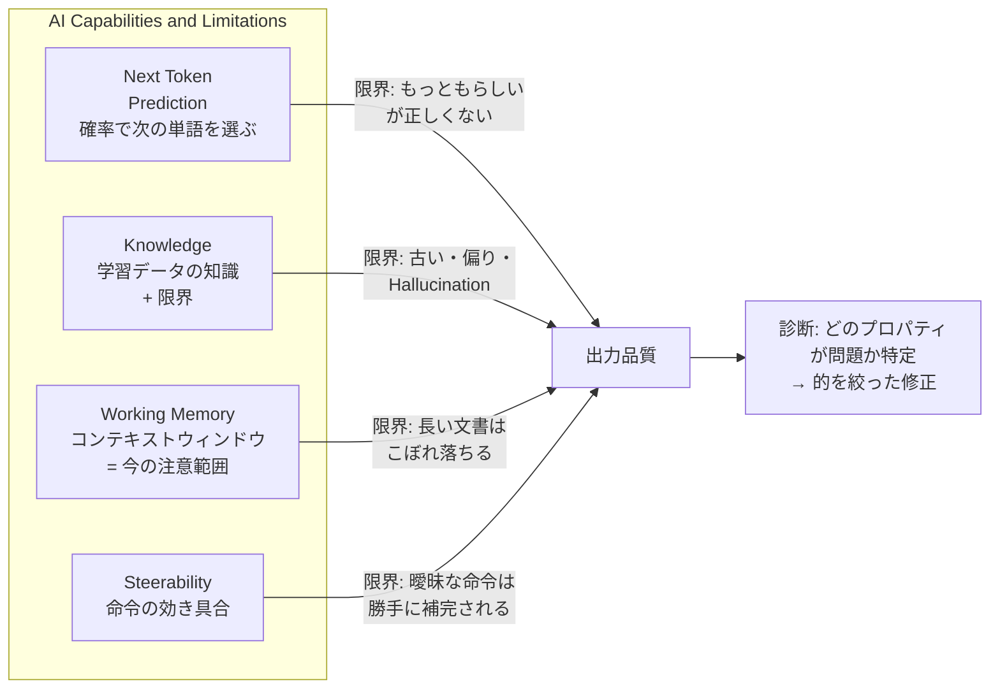

# AI はなぜ正しくて、なぜ間違えるか

## 1. イントロ・全体像

### なぜこのコースが最初に来るか

Claude を使いこなすためのコースは全17本あるが、その多くは「どう使うか」を教える。このコースはその前段として「**AIというものが、そもそもどう動いているか**」を教える。

「AIが間違えた」「AIが妙な答えを返した」という経験は誰でもある。そのたびに「AIって使えないな」で終わるか、「なぜそうなったか」を分析して次に活かせるかで、AI活用力が大きく変わる。

このコースで学ぶのは4つだけ:

```
Next Token Prediction  ← 答えはどこから来るか
Knowledge              ← 何を知っていて、なぜ自信満々に間違えるか
Working Memory         ← 今何を見えていて、何が見えていないか
Steerability           ← 命令はどれだけ実際に効くか
```

4つを理解すると、AIへの「期待値の設定」が正確になる。

### コース全体像



---

## 2. 章別解説

### 2.1 Next Token Prediction (次のトークン予測)

**何が起きているか**

AI は「次に来る最も確率が高い単語 (トークン) を選ぶ」という操作を繰り返して文章を生成している。GPT も Claude も、根本はここ。

人間の文章から「○○の後には△△が来ることが多い」というパターンを大量に学習し、それを確率分布として持っている。

**能力**: 流暢な文章、一貫したスタイル、補完・翻訳・要約が得意。
**限界**: 「確率的に自然な文章」≠「事実として正しい文章」。

```
例:
Q: 東京タワーの高さは?
A: 333メートルです。 ← 正しい (学習データに多い)

Q: 東京タワーが完成した年の東京の市長は誰ですか?
A: ○○です。 ← 自信満々だが間違いの可能性高 (確率的に「もっともらしい名前」を出してしまう)
```

**演習のポイント**: 「AI が自信を持って答えた情報」に対して、「これは next token prediction の産物かもしれない」と疑う習慣をつける。

---

### 2.2 Knowledge (知識)

**何が起きているか**

モデルは学習データに含まれていた情報を「圧縮した形で」持っている。完璧なデータベースではなく、パターンの抽象化。

**能力**: 幅広い一般知識、多言語、コード理解。
**限界 (3種類)**:

| 限界の種類 | 説明 | 対処法 |
|-----------|------|--------|
| Knowledge cutoff | 学習データに終わりがある (Claude は 2025年8月) | 最新情報は別途検索させる |
| Hallucination | 知らないことを「もっともらしく」でっち上げる | 重要な事実は必ず検証 |
| 偏り (Bias) | 学習データの偏りがそのまま出る | 複数の観点で聞き直す |

**演習のポイント**: Hallucination を「嘘をついている」と捉えない。「確率的に自然な次の単語を選んだ結果、事実と合わなかった」が正確な理解。これを理解すると、対処法も変わる。

---

### 2.3 Working Memory (作業記憶)

**何が起きているか**

「コンテキストウィンドウ」= AI が1回のインタラクションで同時に「見えている」情報の範囲。これが Working Memory。

```
[過去の会話] [添付ファイル] [システムプロンプト] [ユーザーの質問]
            ↑ これらの合計がコンテキストウィンドウに収まる必要がある
```

**能力**: ウィンドウ内の情報なら正確に参照・分析できる。
**限界**: ウィンドウを超えた情報は「見えない」。超えると古い情報が押し出される。

**実際の問題パターン**:
- 長いドキュメントの後半を読み飛ばす
- 会話が長くなると最初に言ったことを「忘れる」
- 複数ファイルを一度に渡しすぎると重要な箇所を見逃す

**演習のポイント**: 大きなタスクは「情報を分けて渡す」「重要な指示は最後に再提示する」で対処できる。

---

### 2.4 Steerability (操縦可能性)

**何が起きているか**

命令 (プロンプト) が AI の出力をどれだけコントロールできるか。

**能力**: 明確な制約、役割指定、フォーマット指定には高い応答性。
**限界**: 曖昧な命令は AI が「もっともらしい補完」をする。あなたの意図と一致するとは限らない。

```
曖昧: 「これについてまとめて」
→ 「これ」が何か、「まとめ」の長さ・形式が曖昧 → AI が勝手に判断

明確: 「以下のメールを3行の箇条書きでまとめて。重要なアクションアイテムを太字にして」
→ 制約が明確 → 意図通りの出力になりやすい
```

**演習のポイント**: Steerability は「命令の品質」で大きく変わる。これが Description (4D フレームワークのD) と直結する。

---

### 2.5 プロパティの「衝突」— 実際の現場で起きること

4つのプロパティは現実のユースケースでは常に複合して問題を起こす。

**例: 長い議事録の要約を頼む**
```
Working Memory への圧力 (文書が長すぎる)
+ Knowledge の外の専門用語 (業界固有の言葉)
+ Steerability の問題 (「要約して」が曖昧)
= 「後半を省略した、専門用語を誤解した、形式が違う」要約が出てくる
```

**診断ツール (コアスキル)**

予期しない出力が出たとき:

```
Step 1: どの種類の「予期しない」か?
  - 事実が間違い → Knowledge / Next Token Prediction 問題
  - 重要な箇所を見落とした → Working Memory 問題
  - 意図と違う方向 → Steerability 問題

Step 2: そのプロパティに対応した修正を打つ
  - Knowledge 問題 → 正しい情報を提供、または検索させる
  - Working Memory 問題 → 文書を分割、重要箇所を再提示
  - Steerability 問題 → 命令をより具体的に書き直す

Step 3: 汎用的な「もう一度やって」ではなく、ターゲットを絞る
```

---

## 3. YDのコンテキストへの応用

### Salamat (260名) での活用

**よく使うケース → 各プロパティの罠**

| ユースケース | 該当プロパティ | 落とし穴 | 対処 |
|------------|--------------|---------|------|
| 活動報告書の要約 | Working Memory | 長い報告書の後半が省略される | 章ごとに分けて要約後に統合 |
| フィリピン視察の現地情報収集 | Knowledge cutoff | 最新の地域情報が古い | Claudeに「私が調べた情報を元に」と言って資料を添付 |
| 公式SNSの文章生成 | Steerability | 「Salamatらしい文体」が曖昧 | トーン・文字数・例文を具体的に指定 |
| 会議のアクションアイテム抽出 | Next Token Prediction | もっともらしい内容が混入 | 「この議事録にない内容は絶対に追加しないで」と制約 |

### Task Hub (タスク管理) での活用

```
開発シーン: Firestoreのルール設計を聞く
→ Knowledge 問題に注意: Claude の学習データの Firebase バージョンと
  実際のプロジェクトのバージョンが異なる可能性
→ 対処: `firebase.json` や実際のルールファイルを一緒に貼り付ける
```

### Lecture Hub (ノートハブ) での活用

```
AI要約機能を使う場合:
→ Working Memory 問題: 長い講義ノートは後半が欠落しやすい
→ 対処: 講義を10分セクションに分割してから要約、最後に統合要約
```

### Arte Grow (社会起業) での活用

```
フィリピン現地パートナーとの交渉準備:
→ Knowledge 問題: フィリピンの地域固有の情報は学習データが少ない
→ 対処: 現地で集めた情報 (PDF、自分のメモ) を貼り付けて「この情報をもとに」と指定
```

---

## 4. チートシート

```
┌──────────────────────────────────────────────────────┐
│  4プロパティ クイックリファレンス                     │
├──────────────┬───────────────┬──────────────────────┤
│ プロパティ   │ 起きること    │ 解決策               │
├──────────────┼───────────────┼──────────────────────┤
│ Next Token   │ 確率的に正しい│ 重要な事実は必ず検証  │
│ Prediction   │ 文章 ≠ 真実  │ 「出典は?」と聞く    │
├──────────────┼───────────────┼──────────────────────┤
│ Knowledge    │ Hallucination │ 正確な情報を自分で提供│
│              │ 古い情報      │ 最新情報は検索させる  │
├──────────────┼───────────────┼──────────────────────┤
│ Working      │ 長文の後半欠落│ 分割して渡す          │
│ Memory       │ 指示の忘れ    │ 重要指示は最後に再掲  │
├──────────────┼───────────────┼──────────────────────┤
│ Steerability │ 意図と違う方向│ 制約を具体的に書く    │
│              │ 曖昧補完      │ 例を一緒に示す        │
└──────────────┴───────────────┴──────────────────────┘

診断フロー: 事実ミス→Knowledge | 欠落→Working Memory | 方向ズレ→Steerability
```

---

## 5. 修了試験対策

### 出題されやすいポイント

**Q: AI が Hallucination を起こす根本的な理由は何か?**
A: Next Token Prediction の仕組みにより、「事実として正しい文章」ではなく「統計的に次に来そうな文章」を生成するため。

**Q: コンテキストウィンドウとは何か?**
A: AI が1回の処理で同時に「見ている」情報の最大量。これを超えると情報がこぼれ落ちる。= Working Memory の概念。

**Q: 同じプロンプトで毎回違う回答が出るのはなぜか?**
A: Next Token Prediction は確率的なプロセス。同じ確率分布でもサンプリング結果は毎回異なる (temperature パラメータで制御)。

**Q: AI の「知識の古さ」に対して取れる最も効果的な対処法は?**
A: 最新の情報を自分でプロンプトに貼り付けて「この情報をもとに分析して」と指示する。AIの内部知識に依存しない。

**Q: 4つのプロパティが同時に問題を起こす典型例を説明せよ**
A: 長い専門書の要約を「まとめて」と頼む場合。Working Memory (文書が長い) + Knowledge (専門用語を知らない) + Steerability (「まとめて」が曖昧) + Next Token Prediction (もっともらしい専門用語を生成) が複合する。

---

## 6. 関連リンク

| 種別 | リンク | メモ |
|------|--------|------|
| 公式コース | https://anthropic.skilljar.com/ai-capabilities-and-limitations | Anthropic Academy 受講ページ |
| 関連コース | [[03_ai_fluency_framework]] | 4D フレームワーク (このコースと対になる) |
| 関連コース | [[04_claude_101]] | Claudeの実際の使い方 |
| Vault | `~/ObsidianVault/learning/ai_certifications/anthropic_academy/README` | 18コース全体マップ |

---

## 7. 必須3セクション

### ✅ うまく行ったこと (教科書化プロセス)

- 4プロパティの「診断ツール」フレームワークが非常に実用的。「なぜこうなったか」を特定するための枠組みとして即使える
- 「Next Token Prediction = 確率 ≠ 事実」という理解は、Hallucination を「嘘」ではなく「統計的な産物」と捉え直せるので対処法が変わる
- Salamat の具体ユースケースへの当てはめが自然にできた (長い報告書 → Working Memory 問題)

### ❌ 詰まったこと (受講時に注意すること)

- 4つのプロパティが「独立した問題」ではなく「常に複合して起きる」という点が最初は分かりにくい。演習問題で実際に体験することで理解が深まる
- 「Steerability」という概念が「命令が効く度合い」というのが最初ピンとこないかもしれない。「プロンプトの品質が出力品質を左右する」と言い換えると腑に落ちる
- Knowledge cutoff の「いつ時点か」はモデルによって違う。Claude の場合は 2025年8月

### 📋 次回チェックリスト (コース受講時)

- [ ] 各プロパティの「ハンズオン演習」を実際に手を動かしてやる (読むだけでは理解が浅い)
- [ ] 演習後、自分の普段の使い方でどのプロパティに引っかかってたかを振り返る
- [ ] 「プロパティの衝突」セクションの診断ツールを手元メモに写す (即使える)
- [ ] 修了試験前に「4つのプロパティとそれぞれの対処法」を1枚で書き出す練習をする
- [ ] コース後: このチートシートと照合して、理解が合っているか確認する
