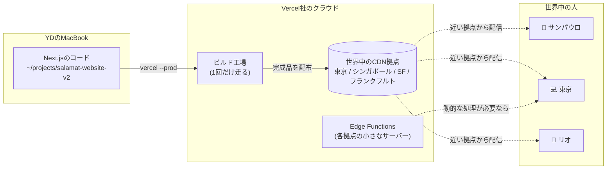
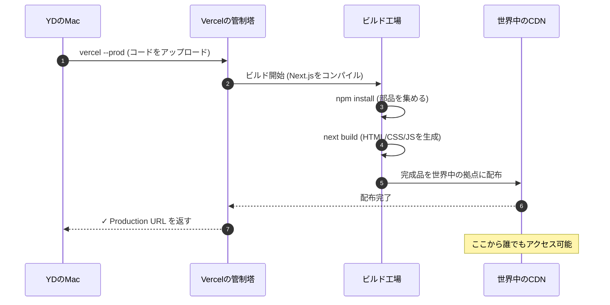
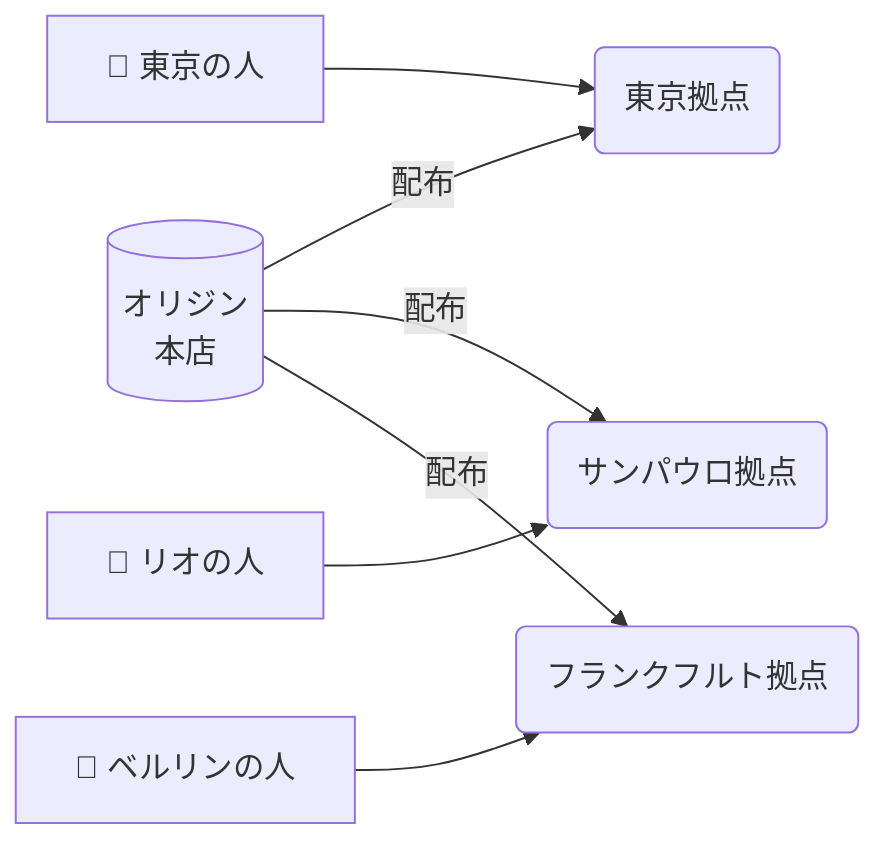

# VercelとNext.jsでサイトを公開するとは何が起きてるのか

## 1. 何が起きた?

2026-05-19の深夜、YDのMacBookのターミナルで1行だけコマンドを打った。

```bash
vercel --prod
```

数十秒待つと、ターミナルに次のような行が表示された (実物のイメージ):

```text
✓ Production: https://salamat-website-v2.vercel.app [3m]
```

この瞬間、**サラマット日本語学校WBS**のサイトが**世界中のどこからでも見られる状態**になった。
ブラジル・サンパウロのスマホからでも、東京の地下鉄でも、同じURLを開けば同じページが出る。

YDが思った素朴な疑問:

> 「これ、自分のMacにあったファイルが、なんで世界中から見られるようになるんだろう?
>  ホスティングサーバーって借りた覚えはないけど、誰が動かしてるの?
>  そもそも *Vercel* って何の会社? *Next.js* って何が偉い?」

この章は、その疑問を**ターミナルすら怖い人向け**に答える。
読み終わると、`vercel --prod` の30秒の裏で起きていることが頭の中で映像になっているはず。

---

## 2. 図解 — Macからインターネット越しに人が見るまで

### 2.1 全体像 (デプロイ後の世界)



*Macのコードは「Vercelのビルド工場」で1回だけ完成品に変換され、その完成品が世界中のCDN拠点にコピーされる。ユーザーは一番近い拠点から取りに行く。*

### 2.2 `vercel --prod` を打ってからの30秒間



*1行のコマンドの裏では「アップロード → ビルド → 世界配布 → URL確定」という4段階が自動で走る。*

---

## 3. キーコンセプト (5つだけ覚える)

### 3.1 Vercel は「Next.jsを作った会社が運営するホスティングサービス」

**Vercel** (ヴァーセル) とは、米国のクラウドサービス会社で、Webサイトを世界中に公開する「場所」を貸してくれる。
普通のレンタルサーバーと違うのは、**設定がほぼゼロ**であること。Gitリポジトリを繋ぐだけで動く。

そしてここが重要 — **Next.jsという有名なフレームワークを作ったのもVercel社**。
だから「Next.jsを動かす場所として、地球上で一番最適化されているのがVercel」と思っていい。

> 用語: **ホスティング** = サイトのファイルを置いておく場所を貸すサービス。賃貸の倉庫みたいなもの。
> 違うのは「世界中のお客さん全員に瞬時に配送する仕組み」までセットになっていること。

### 3.2 Next.js は「Reactで作ったサイトを実用品に仕上げるフレームワーク」

**Next.js** (ネクストジェイエス) は、Webサイトを作るための土台 (フレームワーク) のひとつ。
ベースは **React** (リアクト、Facebookが作ったUIライブラリ) で、それに「ページの仕組み」「画像最適化」「サーバー側処理」をくっつけたもの。

Salamat WBSもこれで作られている。YDがGitHub Codespacesで触っているのも、結局Next.jsのコード。

```text
~/projects/salamat-website-v2/
├── app/                  ← ページごとのフォルダ (Next.jsの作法)
│   ├── page.tsx          ← トップページの中身
│   └── about/page.tsx    ← /about ページの中身
├── public/               ← 画像など固定ファイル
└── package.json          ← 使ってる部品リスト
```

> 用語: **フレームワーク** = 「家を建てるときの骨組みキット」。
> Reactだけだと柱と窓しかないが、Next.jsは玄関・階段・配線まで揃ってる。

### 3.3 CDN は「世界中の倉庫にコピーを置いておく仕組み」

**CDN** (シーディーエヌ、Content Delivery Network の略) とは、
**完成したサイトのコピーを世界中の倉庫にあらかじめ置いておく**仕組み。

東京の人がアクセスしたら東京のCDN拠点から、サンパウロの人がアクセスしたらサンパウロの拠点から配信される。
これで「日本のサーバーをブラジルから見ると遅い」問題が消える。



*CDNは「世界中に支店がある宅配便」みたいなイメージ。本店から商品を一度配ったら、後は支店が直接お客さんに渡す。*

### 3.4 Edge は「各拠点で動く小さなサーバー」

CDNは「完成品をそのまま配るだけ」だけど、サイトには「動的な処理」が必要なこともある。
たとえば「アクセスした人の国を判定して言語を切り替える」「フォーム送信を受け取る」など。

**Edge Functions** (エッジファンクション) は、**CDNの各拠点で動く小さなサーバー**。
本店 (オリジン) まで往復しなくても、近くの拠点で処理できるので速い。

| 種類 | 何ができるか | 速さ |
|------|------------|------|
| 静的ファイル (HTML/CSS/画像) | 配るだけ | ⚡ めっちゃ速い |
| Edge Function | 簡単な処理 (リダイレクト・国判定など) | ⚡ 速い |
| Serverless Function | 重い処理 (DB読み書きなど) | 🟡 普通 |

> 用語: **オリジン** = サイトの「本店」。CDNがない時代は、世界中の人が直接ここに来ていた。
> CDNを使うと、本店の負担が減り、ユーザーは近くの支店から受け取れる。

### 3.5 Build と Deploy は別物

ここが初心者の最大の混乱ポイント。

- **Build (ビルド)** = ソースコードを「ブラウザが読める形」に**変換する作業**
  - 例: TypeScript → JavaScript、複数ファイルを1つに圧縮、画像を最適化
  - 完成品: `.next/` フォルダの中身

- **Deploy (デプロイ)** = ビルド済みの完成品を**世界中のCDNに置く作業**
  - 例: 完成品をVercelのサーバーにアップロード、URLを発行

`vercel --prod` を打つと、この2つが**順番に**走る。
よくある勘違い: 「デプロイ = アップロード」ではない。アップロードは最後の1ステップ。

> 用語: **TypeScript** = JavaScriptに「型」(数字なのか文字なのかの注釈) をつけた言語。書きやすくバグも減るが、ブラウザは直接読めないのでビルド時に普通のJSに変換する。

---

## 4. コード解説 — `vercel --prod` の30秒で何が起きるか

### 4.1 そもそもデプロイ前のセットアップ

最初の一回だけ、こんな手順を踏む (Salamat WBSの場合は2025年内に完了済み):

```bash
# 1. Vercel CLI を入れる (1回だけ)
npm i -g vercel
# → 「vercel」コマンドが使えるようになる

# 2. プロジェクトのフォルダに入る
cd ~/projects/salamat-website-v2

# 3. Vercelとリンクする (1回だけ)
vercel link
# → 「どのVercelアカウント?」「どのプロジェクト?」を聞かれて答える
# → .vercel/ という隠しフォルダができる (リンク情報の保存先)
```

> 用語: **`npm i -g`** = npm install --global の省略。「世界中で使えるツール」として入れる。
> `-g` がないと「このプロジェクトだけで使える」という意味になる。

### 4.2 本番デプロイの1行

```bash
cd ~/projects/salamat-website-v2  # プロジェクトに移動
vercel --prod                      # 本番URLにデプロイ
```

`--prod` を付けないと「プレビューURL」 (テスト用URL) になる。
本番URL (`salamat-website-v2.vercel.app`) を更新したいときは必ず `--prod` を付ける。

### 4.3 ターミナルに流れる出力の読み方

```text
Vercel CLI 33.0.1
🔍  Inspect: https://vercel.com/.../inspect [2s]   ← ① 管理画面のURL
✅  Production: https://salamat-website-v2.vercel.app [3m]   ← ② 完成URL

Building...
[Build] $ next build                              ← ③ Next.jsのビルドを実行
[Build] ▲ Next.js 14.2.0
[Build] ✓ Compiled successfully                   ← ④ コンパイル成功
[Build] ✓ Generating static pages (12/12)         ← ⑤ 12ページぶんHTML生成
[Build] Route (app)                Size     First Load JS
[Build] ┌ ○ /                      1.2 kB   85 kB     ← ⑥ 各ページの容量
[Build] ├ ○ /about                 0.8 kB   84 kB
[Build] └ ○ /admissions            1.5 kB   86 kB
Deploying outputs...                              ← ⑦ CDNに配布開始
```

意味:

| ステップ | 何をしているか |
|---------|--------------|
| ① Inspect | Web画面でリアルタイムに状況を見るためのURL |
| ② Production | 完成後にアクセスできる本番URL |
| ③ next build | Next.js本体がビルドを実行 |
| ④ Compiled | TypeScriptをJavaScriptに変換完了 |
| ⑤ Generating static pages | HTMLを事前に作っておく (爆速の秘訣) |
| ⑥ Size表 | 各ページが何KBあるか (小さいほど速い) |
| ⑦ Deploying outputs | 完成品を世界中のCDNに送信中 |

### 4.4 失敗したらどう読むか

ビルドが失敗するとこんな出力になる:

```text
[Build] Failed to compile.
[Build] ./app/page.tsx:23:8
[Build] Type error: Property 'titleJa' does not exist on type 'School'.
[Build] Error: Command "next build" exited with 1
```

読み方:
- `Failed to compile` = ビルド失敗。デプロイは止まる (= 本番URLは更新されない、これは安全機構)
- `./app/page.tsx:23:8` = ファイルパス:行番号:列番号
- `Type error: ...` = TypeScriptの型エラー (= データの形が想定と違う)

**重要**: ビルドが失敗してもユーザーには影響がない。本番URLは前回成功したバージョンのまま動き続ける。
これがVercelの安全機構。**「壊れたものは公開されない」**。

### 4.5 デプロイの履歴を見る

```bash
vercel ls                          # 最近のデプロイ一覧
# →
# Age     Deployment                              Environment
# 5m      https://salamat-website-v2-xxx.vercel.app  Production ✓
# 1h      https://salamat-website-v2-yyy.vercel.app  Preview
# 1d      https://salamat-website-v2-zzz.vercel.app  Production
```

過去のデプロイURLは**そのまま残っている**。
だから「昨日のデプロイで表示が壊れた、昨日まで戻したい」という時は、
Vercelの管理画面で過去のデプロイを「Promote to Production」できる。これが**ロールバック**。

> 用語: **ロールバック** = 「巻き戻し」。新しいバージョンに問題があったら、ボタン1つで前のバージョンに戻せる。

---

## 5. 次やる時のチェックリスト

### 初めてデプロイするとき

- [ ] **準備**: Vercelアカウント作成 (GitHubアカウントで連携できる)
- [ ] **Step 1**: `npm i -g vercel` でCLIインストール (1回だけ)
- [ ] **Step 2**: プロジェクトフォルダで `vercel link` (1回だけ)
- [ ] **Step 3**: `vercel` で**プレビュー**デプロイ → 仮URLで動作確認
- [ ] **Step 4**: 問題なければ `vercel --prod` で本番デプロイ
- [ ] **片付け**: ターミナル閉じてOK。サイトは動き続ける

### 2回目以降のデプロイ

- [ ] コード編集
- [ ] ローカルで `npm run dev` で動作確認 (= `http://localhost:3000` で見える)
- [ ] OKなら `vercel --prod`
- [ ] 出力の最後の `Production:` のURLを開いて確認

### 失敗を防ぐルール

- ✅ **本番デプロイの前にプレビューで確認**: いきなり `--prod` を付けない
- ✅ **ローカルで `npm run build` を試す**: 本番ビルドと同じことをローカルで試せる
- ✅ **環境変数は管理画面で設定**: `.env.local` をGitHubにpushしない (秘密が漏れる)
- ❌ **`vercel rm` (削除) は絶対に確認**: プロジェクトごと消える
- ❌ **本番デプロイ後に `git push --force` しない**: 過去のデプロイURLが壊れる可能性

### サイトが見えなくなったとき

- [ ] Vercel管理画面 (https://vercel.com/dashboard) を開く
- [ ] 該当プロジェクトの Deployments タブを見る
- [ ] 最新のデプロイが **Error** になっていないか確認
- [ ] Errorなら、その1つ前の Ready なデプロイで「Promote to Production」
- [ ] それでもダメなら DNS設定 (ドメイン側) を疑う

---

## 6. 関連リンク

| 種別 | リンク | メモ |
|------|--------|------|
| 公式 | https://vercel.com/docs | Vercel 公式ドキュメント |
| 公式 | https://nextjs.org/docs | Next.js 公式ドキュメント (日本語あり) |
| 概念 | https://en.wikipedia.org/wiki/Content_delivery_network | CDNの仕組み (Wikipedia) |
| 実例 | https://salamat-website-v2.vercel.app | Salamat WBS本番サイト (この教材の題材) |
| 教材 | [[01_claude_code_parallel]] | 並列セッションでデプロイも回せる |
| Vault | `~/ObsidianVault/knowledge/programming/tools/` | Vercel/Next.jsの運用知識を蓄積する場所 |

---

## 7. 用語集

| 用語 | 意味 |
|------|------|
| **Vercel** | Next.jsを作った米国の会社が運営するホスティングサービス。Gitリポジトリと繋ぐだけで世界中にサイトを公開できる。 |
| **Next.js** | Reactベースのフレームワーク。ページの仕組み・画像最適化・サーバー処理が最初から揃っている。Vercel社が開発。 |
| **React** | Facebook (現Meta) が作ったUIライブラリ。「画面を部品 (コンポーネント) に分けて組み立てる」発想。Next.jsの土台。 |
| **フレームワーク** | アプリの「骨組みキット」。ライブラリより大きく、設計のルールまで決まっている。 |
| **CDN** | Content Delivery Networkの略。サイトの完成品を世界中の拠点にコピーしておき、近い拠点から配信する仕組み。 |
| **オリジン** | CDNの「本店」。最初に完成品が置かれる場所。各拠点はここから定期的にコピーを取る。 |
| **Edge / Edge Function** | CDNの各拠点で動く小さなサーバー。リダイレクトや国判定など軽い処理が高速にできる。 |
| **Serverless Function** | 「サーバーレス」という名前だが実際にはサーバーで動く。違いは「使ったぶんだけ自動で起動」する点。重い処理向け。 |
| **Build (ビルド)** | ソースコードをブラウザが読める形に変換する作業。`next build` で実行。 |
| **Deploy (デプロイ)** | ビルド済みの完成品を世界中のCDNに置いて公開する作業。`vercel --prod` で実行。 |
| **Production / Preview** | 本番URL / テスト用URL。Vercelでは `--prod` フラグで切り替える。 |
| **環境変数** | パスワードやAPIキーなど「コードに直接書きたくない秘密」を入れる箱。Vercel管理画面で設定する。 |
| **ロールバック** | 新しいデプロイに問題が出たとき、過去のデプロイをボタン1つで本番に戻すこと。 |
| **DNS** | Domain Name System。「`salamat-website-v2.vercel.app`」という名前を「サーバーのIPアドレス」に変換する電話帳。 |
| **`npm`** | Node.jsの部品 (パッケージ) を管理するツール。`npm install` で部品をダウンロード。 |
| **`npx`** | npmで配布されているツールを「インストールせず1回だけ実行」するコマンド。 |
| **`.env.local`** | 環境変数をローカルだけで使うために置くファイル。**絶対にGitHubにpushしない**。 |
| **TypeScript** | JavaScriptに「型」をつけた言語。書きやすくバグも減る。ビルド時に普通のJSに変換される。 |
| **HMR** | Hot Module Replacement。ローカル開発中にコードを保存すると画面が即座に更新される仕組み。Next.jsは標準対応。 |

---

*この教科書は、Salamat WBSが本番公開された次の日 (2026-05-20) の早朝、
セッション02が並列で書き始めた。第1号「Claude Code 4並列」を読んだ後にこれを読むと、
「あの並列セッションのうちの1人がSalamatをデプロイしている」絵が立体的に浮かぶ — はず。*
