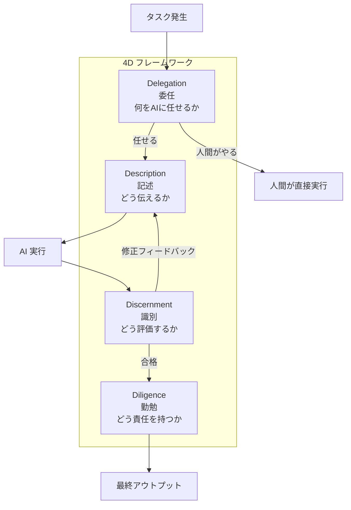

# AI と仕事をする技術 — 4D フレームワーク

## 1. イントロ・全体像

### このコースが必要な理由

「AIを使っている」と「AIをうまく使っている」は別物だ。

ツールとして使いこなすには「型」が必要。このコースが提供するのが **4D フレームワーク** — Anthropic が University College Cork の Prof. Feller と Ringling College の Prof. Dakan と共同で作った、AI との協働を体系化した枠組み。

12レッスン、3-4時間 (動画約70分)。マネージャー、教育者、チームリードに特に推奨される内容だが、AIを使う全員に当てはまる。

### 4D フレームワーク全体像



---

## 2. 章別解説

### 2.1 AI Fluency とは何か (コースのベースライン)

**定義**: 「AI システムと効果的・効率的・倫理的・安全に協働する能力」

「ツールの使い方を知っている」ではない。AI との相互作用を**意図的に設計**して、望む結果を出せる能力。

**人間 vs AI の相補的な強み**

| 人間が得意なこと | AI が得意なこと |
|----------------|----------------|
| 批判的思考・判断 | 速度・スケール |
| 創造性 | パターン認識 |
| 倫理的監視 | 大量の情報処理 |
| 文脈・感情の理解 | 一貫したフォーマット維持 |

コツ: 「AIを競合」と見るのをやめて「自分の拡張」として使う思考に切り替える。

---

### 2.2 Delegation (委任) — 何をAIに任せるか

**問い**: すべてのタスクをAIに任せていいか?

答えは No。Delegation は「タスクの分類」から始まる。

**AIに任せていいタスク vs 人間がやるべきタスク**

```
AI向き (委任する):
✅ 反復的・定型的な処理 (文書フォーマット統一、データ変換)
✅ 大量のテキスト処理 (要約、翻訳、分類)
✅ アイデアのドラフト生成 (最終判断は人間)
✅ 複数の選択肢を素早く生成して比較する

人間がやるべき (委任しない):
❌ 倫理的・法的な最終判断
❌ 感情や関係性が重要な意思決定
❌ AI が持っていない機密情報が必要な判断
❌ アウトプットの最終責任を持つこと
```

**演習**: 自分の1週間のタスクリストを見て、「AIに任せられる」「人間がやる」「AIを補助に人間が判断」の3列に分類する。

---

### 2.3 Description (記述) — どう伝えるか

フレームワークの中核。「AI が意図を読んでくれる」という幻想を捨てて、明確に伝える技術。

**プロンプト品質の7要素**

| 要素 | 悪い例 | 良い例 |
|------|--------|--------|
| **役割** | (なし) | 「マーケターとして回答して」 |
| **目的** | 「まとめて」 | 「3行の要点として箇条書きにして」 |
| **対象読者** | (なし) | 「IT知識のない高齢者向けに」 |
| **制約** | (なし) | 「200文字以内で、専門用語なしで」 |
| **フォーマット** | (なし) | 「Markdown の表形式で」 |
| **例示** | (なし) | 「以下の例に似たトーンで: ...」 |
| **禁止事項** | (なし) | 「リスト内の情報以外は追加しないで」 |

**迭代 (イテレーション) の重要性**

Description は1発で完成しない。フィードバックループを前提にする:

```
初稿プロンプト → AI 出力 → 問題特定 → フィードバック付きで再依頼
                                     ↑
                               問題を具体的に:
                               「○○の部分がXXという理由で使えない。
                                代わりに△△の方向でもう一度」
```

---

### 2.4 Discernment (識別) — どう評価するか

AI の出力を批判的に評価するスキル。AI が出した答えを「鵜呑みにしない」が基本姿勢。

**評価の4軸**

1. **正確性**: 事実として正しいか? (Hallucination チェック)
2. **完全性**: 重要な情報が抜けていないか?
3. **関連性**: 自分のユースケースに本当に使えるか?
4. **偏り**: 特定の観点に偏っていないか?

**Discernment の実践ツール**

```
不確かな事実が出てきたら:
→ 「この情報の出典を教えて」
→ 「これが正しいか確信が持てない。別の観点で検証して」
→ 自分で一次情報を確認する

出力が期待と違ったら:
→ 「○○の部分が期待と違う理由を説明して」(原因理解)
→ 「△△の観点が欠けている。追加して」(補完)
→ 新しいプロンプトで再試行 (Description に戻る)
```

---

### 2.5 Diligence (勤勉) — どう責任を持つか

AI を使う上での倫理的・責任的な側面。「便利だから使う」ではなく「正しく使う」。

**AIの重要な限界 (Diligence が必要な理由)**

| 限界 | 具体的な問題 | 対処 |
|------|------------|------|
| 非決定論的 | 同じプロンプトで毎回違う出力 | 重要なアウトプットは複数回試す |
| Knowledge cutoff | 古い情報を自信満々で出す | 最新情報は別途検証 |
| Hallucination | 存在しない情報を生成 | 重要な事実は必ず一次情報確認 |
| Context window | 長い文書を読み落とす | 分割して渡す |

**倫理的チェックリスト**

```
AIを使う前:
- [ ] 個人情報・機密情報を入力しようとしていないか?
- [ ] AI の判断に全責任を負わせようとしていないか?
- [ ] AI が持っていない情報を必要とする判断をさせようとしていないか?

AIを使った後:
- [ ] 出力を検証したか?
- [ ] アウトプットへの最終責任は人間 (自分) が持てるか?
- [ ] 利用規約・プライバシーポリシーを確認しているか?
```

---

## 3. YDのコンテキストへの応用

### Salamat (260名) × 4D フレームワーク

**チームへの4D 導入シナリオ**

Salamat の新メンバー (18歳入学したてのケース) に「AIを使って業務を効率化」を教える際のフレームワークとして4D は最適。「とりあえず聞けばいい」から「どう依頼するかを設計する」へ意識を変えられる。

```
実際のシーン:
フィリピン視察の現地パートナーへのメール草案作成

Delegation: メールの構造と言語は AI に、最終的な内容判断は自分
Description: 「英語で、フォーマルすぎず、視察の目的 (Arte Grow の現地調査) を
              伝え、YDとTaichiの2名が9月に訪問予定という情報を含む、
              150-200語のメール。添付情報: (概要PDF)」
Discernment: ビジネスレターとして失礼な表現がないか確認、現地文化との
             齟齬がないかネイティブに確認
Diligence: 送信前に一字一句自分で読む。AIが作ったメールの責任は自分が持つ
```

### Task Hub 開発 × 4D

```
Description の改善例:
❌ 「Firestoreのルールを書いて」
✅ 「Firebase 9系 + Next.js 14のプロジェクト。Firestoreのルールを書いて。
    要件: (1) 認証済みユーザーのみ自分のデータを読み書き可能
          (2) サークルメンバー (members コレクション) は互いのタスクを読める
          (3) 管理者ロール (role: admin) は全データを読み書き可能
    現在の rules ファイルの内容: [貼り付け]
    
    新しいルールのみ出力。説明は不要。」
```

### Apple 業務 × 4D

iPhone 販売トーク (日本1位) の経験を AI に応用:
- **Delegation**: お客様との実際の会話は自分がやる。事前準備 (商品知識整理、よくある質問の回答集) はAI
- **Description**: 「iPhone 16 Pro と 16 Plus の比較表を作って。対象: デジカメを持っていて初めてスマホを買う50代のお客様。技術用語は使わず、撮影・電話・ライン機能の観点で比較」

### 朝ブリーフィング / ai-researcher × 4D

```
Diligence の観点:
- ai-researcher が毎時収集する記事は Hallucination なし (実在の記事)
- ただし要約・関連度判定は AI 処理 → Discernment が必要
- 朝ブリーフィングの音声 (Kyoko TTS) で聞いた情報を
  「そのまま事実として使う」は Diligence 違反
→ 重要な情報は一次ソースを確認する習慣
```

---

## 4. チートシート

```
┌─────────────────────────────────────────────────────────┐
│  4D フレームワーク チートカード                          │
├──────────────┬──────────────────────┬──────────────────┤
│ D            │ 問い                 │ 即効アクション   │
├──────────────┼──────────────────────┼──────────────────┤
│ Delegation   │ これをAIに任せるべき  │ タスクを3分類:   │
│ (委任)       │ か?                  │ AI/人間/協働     │
├──────────────┼──────────────────────┼──────────────────┤
│ Description  │ AIに何を・どう伝えるか│ 役割+目的+制約   │
│ (記述)       │ 意図は伝わってるか?  │ +例+禁止事項     │
├──────────────┼──────────────────────┼──────────────────┤
│ Discernment  │ この出力は信頼できるか│ 事実確認+完全性  │
│ (識別)       │ 何が抜けている?      │ +関連性+偏り     │
├──────────────┼──────────────────────┼──────────────────┤
│ Diligence    │ 責任は持てるか?      │ 個人情報NG+      │
│ (勤勉)       │ 倫理的に問題ないか?  │ 最終確認+検証   │
└──────────────┴──────────────────────┴──────────────────┘

AI の4大限界: 非決定論的 / Knowledge cutoff / Hallucination / Context window
```

---

## 5. 修了試験対策

**Q: 4D フレームワークの各 D を日本語で説明せよ**
A: Delegation (委任: 何をAIに任せるか) / Description (記述: 明確なプロンプト作成) / Discernment (識別: AI出力の批判的評価) / Diligence (勤勉: 責任ある倫理的利用)

**Q: 「AI Fluency」の定義は?**
A: AI システムと「効果的・効率的・倫理的・安全」に協働する能力。ツールの操作方法だけでなく、意図的な設計と責任ある利用を含む。

**Q: Description (記述) で最も重要なプロンプト要素は?**
A: 明確な目的・制約・対象読者・フォーマット指定。「曖昧な指示は AI が勝手に補完する」ため、意図通りの出力を得るには具体的な制約が必要。

**Q: Discernment (識別) で評価すべき4軸は?**
A: 正確性 / 完全性 / 関連性 / 偏り

**Q: 非決定論的 (non-deterministic) な AI 出力の意味と対処法は?**
A: 同じプロンプトで毎回異なる出力が生まれること。重要なアウトプットは複数回試し、比較・選択する。

**Q: Diligence (勤勉) の観点で、AI に入力してはいけない情報の例は?**
A: 個人情報・機密情報・クライアントの機密データ。AIのクラウド処理に送信されるため、プライバシーリスクがある。

---

## 6. 関連リンク

| 種別 | リンク | メモ |
|------|--------|------|
| 公式コース | https://anthropic.skilljar.com/ai-fluency-framework-foundations | Anthropic Academy |
| 関連コース | [[02_ai_capabilities_and_limitations]] | 4D フレームワークと対になるAIの仕組み |
| 関連コース | [[04_claude_101]] | 4D を Claude で実践する |
| 業種別展開 | Anthropic Academy "AI Fluency for Nonprofits" 等 | 非営利版 (Salamat に最も近い) |
| Vault | `~/ObsidianVault/learning/ai_certifications/anthropic_academy/README` | コース全体マップ |

---

## 7. 必須3セクション

### ✅ うまく行ったこと

- 4D フレームワークが「AI を使う前・使う中・使った後」のフローとして自然に並ぶ。Delegation (前) → Description (中: 依頼) → Discernment (中: 評価) → Diligence (後) という流れが直感的
- 「Diligence (勤勉)」という訳語が日本語では少し固く聞こえるが、「使ったらちゃんと責任持って」という意味が的確
- Salamat/Apple/Task Hub それぞれへの応用が具体的に描けた

### ❌ 詰まったこと

- Description と Discernment の境界が曖昧になりやすい。「出力を評価して再依頼」は Description か Discernment か? → 「評価する行為がDiscernment」「再依頼するプロンプトを書く行為がDescription」と分けると整理しやすい
- 「Diligence = 倫理的利用」という定義が抽象的すぎて最初イメージしづらい。具体例 (個人情報入力禁止、最終判断は人間) で理解が深まる
- コース自体の動画は英語 (字幕あり) のため、英語が苦手な場合は1.5倍速+字幕で理解に時間がかかる可能性あり

### 📋 次回チェックリスト (コース受講時)

- [ ] コース開始前: 自分の普段のタスクを「Delegation の観点」で分類してみる (受講後の理解が深まる)
- [ ] Description のプロンプト7要素を手元メモに書き出す
- [ ] コース内の演習は「実際の自分のタスク」で試す (Salamat/Task Hub の具体例で)
- [ ] 「AI が良い出力をしたとき」と「悪い出力をしたとき」、どの D が効いたか/欠けたかを分析する習慣を始める
- [ ] 修了後: Discernment の評価4軸でこの教科書自体を評価してみる (メタ演習)
