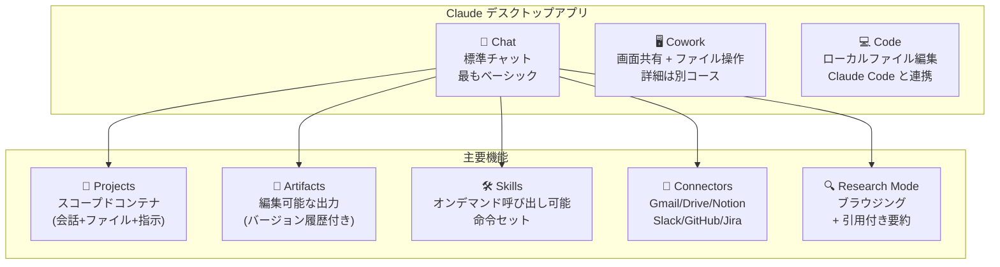

# Claude の全機能を30分で把握する

## 1. イントロ・全体像

### このコースの位置づけ

AI の仕組み (AI Capabilities) と協働フレームワーク (4D) を理解した上で、「じゃあ Claude 自体はどう使うのか」を教えるのがこのコース。

5モジュール・13レッスン・2-3時間。コーディング不要。Anthropic のアカウントがなくても受講できる (受講証書には必要)。

**このコースを取るべき人**: 「Claude を毎日使っているがほとんどのボタンの意味を知らない」という全ての knowledge worker。

### Claude の機能マップ



---

## 2. 章別解説

### 2.1 Module 1: Meet Claude (2レッスン)

**Claudeとは何か**

Anthropic が開発した AI アシスタント。ChatGPT と何が違うのか? 主な差異:
- **Constitutional AI**: 安全性・誠実性を訓練の根本に置く設計
- **Long context**: 長い文書を扱える (100K+ トークン)
- **強みはライティング・分析・コーディングのバランス**

**Claude の3モード (デスクトップアプリ)**

| モード | 何をするか | 使いどき |
|--------|----------|---------|
| Chat | テキスト会話 | 質問、ブレスト、文章作成 |
| Cowork | PCの画面を見ながら作業 | ファイル操作、長い作業の自動化 |
| Code | ローカルコードへのアクセス | プログラミング、ファイル編集 |

**演習**: Claude を開いて、「あなたについて教えて」と日本語で入力する。Chat モードの基本操作を確認。

---

### 2.2 Module 2: Getting Better Results (2レッスン)

**デスクトップアプリの強み**

Web 版と違い、デスクトップアプリはスクリーン読み取り機能 (Cowork) やローカルファイルアクセス (Code) を持つ。

**基本的なプロンプティング**

このモジュールで教えるのは「より良い結果を得るための命令の書き方」。4D フレームワークの Description が実践的な形で登場する。

```
黄金ルール3つ:
1. 役割を与える: 「〇〇のエキスパートとして」
2. 制約を入れる: 「〇〇文字以内」「〇〇形式で」「〇〇は使わない」
3. 例を見せる: 「以下のような形式で: (例)」
```

**演習**: 自分の仕事の典型的なタスクを1つ選んで、この3つを意識したプロンプトを書いてみる。

---

### 2.3 Module 3: Organizing Work & Knowledge (3レッスン)

Claude の「使いこなし度」が最も差が出るモジュール。

#### Projects — 作業の文脈を保存する

**Projects = 会話 + 参照ファイル + カスタム指示** の組み合わせを名前をつけて保存するもの。

```
例: 「Salamat WBS プロジェクト」
  → 過去の会話ログ
  → 参照ファイル: design-brief.md、メンバー一覧.csv
  → カスタム指示: 「Salamat は260名の国際ボランティアサークル。
                   次の視察地はフィリピン。回答は日本語で」

効果: 毎回「Salamatは...」と説明しなくていい
```

Projectsは **Pro プラン以上** で利用可能 (Free プランは毎回コンテキストをリセット)。

#### Artifacts — 出力をそのまま資産にする

**Artifacts = AI が作った成果物を、独立した編集可能ドキュメントとして保存する機能**。

単純なチャット回答と何が違うか:
- **バージョン履歴**: 「3回前の版に戻して」が可能
- **ライブコードプレビュー**: HTML/CSS/JSならブラウザで即確認
- **共有可能**: リンクで他の人に渡せる

```
実際の使い方:
「Salamat 活動報告書のテンプレートを Markdown 形式で作って」
→ Artifact として保存
→ 来月は「先月の Artifact を参考にして今月版を作って」でOK
```

#### Skills — カスタム命令をボタンに変える

**Skills = よく使うプロンプトや操作手順をワンクリックで呼び出せるようにする機能**。

```
例: 「英語メールを日本語に翻訳して、要点を3行でまとめる」スキル
→ 作成: この命令をスキルとして登録
→ 使用: メールを貼り付けてスキルボタンをクリック

Pro プラン以上が必要。
```

---

### 2.4 Module 4: Expanding Claude's Reach (3レッスン)

Claude を外部サービスと繋げて「情報を自分で取ってくる」機能群。

#### Connectors — 外部サービスと繋がる

| コネクタ | 何ができるか |
|---------|------------|
| Gmail | メール検索、返信草案作成 |
| Google Drive | ドキュメント読み込み、作成 |
| Notion | ページ検索、作成・更新 |
| Slack | メッセージ検索・送信 |
| GitHub | PR サマリ、コードレビュー |
| Jira | チケット作成・更新 |
| Linear | 同上 |

```
実用例 (YD向け):
「今週のSalamat Slackの未読を全部要約して、
 アクションアイテムがあれば Notion の今週タスクに追加して」
→ Slack コネクタ + Notion コネクタを組み合わせ
```

#### Enterprise Search — 組織内横断検索

組織が接続したデータソース (社内Wiki、Confluence、Google Drive等) を横断して検索する機能。Team / Enterprise プランで本格利用。

#### Research Mode — 最新情報を自分で取ってくる

**Research Mode = Claude 自身がウェブを検索して情報を集め、引用付きで要約する**。

Knowledge cutoff の問題 (古い情報しか持っていない) を部分的に解決する。

```
使いどき:
- 最新のニュース・イベントについて知りたいとき
- 事実確認が必要な情報を素早く集めたいとき
- 「この論文の要点を教えて + 関連文献を3本調べて」

制限:
- 全プランで利用可能だが利用回数に上限あり
- 取得した情報は依然として Hallucination チェックが必要
```

---

### 2.5 Module 5: Putting It All Together (3レッスン)

業種別のユースケースと「次に学ぶべきこと」のロードマップ。

**部門別ユースケース例**

| 部門 | 代表的なユースケース |
|------|---------------------|
| Marketing | SNS投稿バリエーション作成、A/Bテスト案 |
| HR | 採用メール草案、研修資料作成 |
| Finance | 数値レポート解釈、予算コメント作成 |
| Engineering | コードレビュー、ドキュメント生成 |
| Operations | SOP (手順書) 整備、ミーティングサマリ |
| Sales | 商談メール、提案書ドラフト |

コース最後に「次はどのコースに進むか」のロードマップが提示される。

---

## 3. YDのコンテキストへの応用

### Projects でSalamat を爆速化する

**「Salamat 運営」Project を作る**

```
Project 設定:
- 参照ファイル:
  - 2026年度活動計画.md
  - メンバー一覧 (260名、役職付き).csv
  - 定例ミーティングアジェンダテンプレート.md
  
- カスタム指示:
  「Salamat は東洋大学の国際ボランティアサークル。
   代表はYD (Yitao Ding)。次の視察先はフィリピン。
   回答は常に日本語で、会議用語は簡潔に。
   フォーマルすぎず、親しみやすいトーンで」

効果:
  ✅ 毎回コンテキスト説明が不要
  ✅ 活動計画と矛盾した提案をされない
  ✅ メンバー名を参照した提案ができる
```

### Artifacts で学習コンテンツを資産化する

```
Anthropic Academy 各コースの受講メモ → Artifact として保存
→ 「先週のコース1のArtifact を参考にして、
   今日のコース2の学習メモを同じ構造で作って」

毎回ゼロから作らずに蓄積できる
```

### Connectors で Tasks Hub と連携する

```
現在 Task Hub は Firebase + Next.js。
Connectors で直接つながるのは Notion / Jira / Linear 等。

代替案:
- Notion に Salamat タスクを集約 → Notion コネクタで Claude が読む
- GitHub コネクタで Task Hub の PR を自動サマリ

将来的に: Task Hub に Webhook + Slack 通知を追加 →
          Slack コネクタ経由で Claude がタスク更新を把握
```

### Research Mode でフィリピン視察の下調べ

```
「Arte Grow の2026年9月フィリピン視察のために、
 以下を調査してほしい (引用を必ず含めること):
 1. セブ島の農村部における教育機会の現状 (最新データ)
 2. フィリピンの NGO 設立に必要な法的要件
 3. 現地の主要な教育系 NGO 3組織の活動内容」

→ Research Mode で自動検索 + 引用付き要約
```

---

## 4. チートシート

```
┌─────────────────────────────────────────────────────────┐
│  Claude 101 機能チートシート                             │
├───────────────┬──────────────────────┬─────────────────┤
│ 機能          │ 何のためか           │ 必要プラン      │
├───────────────┼──────────────────────┼─────────────────┤
│ Chat          │ 基本チャット          │ Free~           │
│ Cowork        │ ファイル/PC操作      │ Pro~            │
│ Code          │ ローカルコード編集   │ Pro~            │
├───────────────┼──────────────────────┼─────────────────┤
│ Projects      │ 文脈・ファイルを保存  │ Pro~            │
│ Artifacts     │ 出力を資産として保存  │ Free~ (基本)    │
│ Skills        │ よく使う命令を登録   │ Pro~            │
├───────────────┼──────────────────────┼─────────────────┤
│ Connectors    │ 外部サービス連携     │ Pro~ / Teams    │
│ Enterprise    │ 社内検索             │ Teams / Enterprise│
│ Search        │                      │                 │
│ Research Mode │ ウェブ自動検索       │ Free~ (上限あり)│
└───────────────┴──────────────────────┴─────────────────┘

Projects の3要素: ① 会話履歴  ② 参照ファイル  ③ カスタム指示
Artifacts の強み: バージョン管理 + ライブプレビュー + 共有可能
```

---

## 5. 修了試験対策

**Q: Claude の Projects 機能が通常の会話と異なる3つの要素は?**
A: ① 会話履歴を引き継ぐ ② 参照ファイルを持続的に参照できる ③ カスタムシステムプロンプト (指示) を保存できる

**Q: Artifacts と通常の回答の違いは?**
A: Artifacts はバージョン履歴・共有機能・ライブコードプレビューを持つ独立した成果物。通常の回答はチャット内に埋め込まれるだけで版管理できない。

**Q: Claude デスクトップアプリの3モードを説明せよ**
A: Chat (標準テキスト会話) / Cowork (画面共有によるファイル操作・タスク実行) / Code (ローカルファイルの読み書き・編集)

**Q: Research Mode が解決する問題は何か?**
A: Knowledge cutoff (学習データの時間的限界) による古い情報の問題。ウェブ検索で最新情報を取得し、引用付きで回答する。

**Q: Skills が Pro プラン以上に限定される理由として考えられることは?**
A: Skills は組織レベルのワークフロー自動化に使われる高度な機能であり、個人の無料ユーザーより業務利用者向けに設計されているため。(コースの公式説明ではなく推測込み)

**Q: Connectors で繋がる外部サービスを5つ挙げよ**
A: Gmail / Google Drive / Notion / Slack / GitHub (+ Jira / Linear)

---

## 6. 関連リンク

| 種別 | リンク | メモ |
|------|--------|------|
| 公式コース | https://anthropic.skilljar.com/claude-101 | Anthropic Academy |
| 前提コース | [[02_ai_capabilities_and_limitations]] | AIの仕組みの理解 |
| 前提コース | [[03_ai_fluency_framework]] | 4D フレームワーク |
| 次のコース | [[05_intro_to_claude_cowork]] | Cowork の詳細 |
| 公式 | https://claude.com/resources/courses | Claude 公式コースページ |
| Vault | `~/ObsidianVault/learning/ai_certifications/anthropic_academy/README` | 18コース全体マップ |

---

## 7. 必須3セクション

### ✅ うまく行ったこと

- 5モジュール13レッスンの構造がシンプルで理解しやすい。「使い始め → 機能深掘り → 外部連携 → 実践応用」というフローが自然
- Projects の概念が「毎回コンテキスト説明しなくていい」という具体メリットに直結して伝わりやすい
- Salamat の260名運営やTask Hub開発など、YDの具体ユースケースへの適用が明確に描けた

### ❌ 詰まったこと

- Free プラン / Pro プラン / Team / Enterprise でできることが違うため、「この機能を試そうとしたらできなかった」が起きやすい。コース受講前に自分のプランを確認しておく
- Skills と Connectors は Pro 以上が必要なので、Free プランのまま受講するとデモ動画を見るだけで実際に試せない機能が多い
- Research Mode の「利用回数上限」が具体的に何回かはコース内では明示されない可能性あり

### 📋 次回チェックリスト (コース受講時)

- [ ] 受講前: 自分の Claude プランを確認する (Free/Pro/Team?)
- [ ] Module 3 受講中: 自分のユースケースで Projects を1つ作ってみる
- [ ] Module 4 受講中: Notion / Slack のうち使っているものでコネクタを設定する
- [ ] Research Mode: フィリピン視察に関連する実際の調査クエリで試す
- [ ] コース後: 使っていなかった機能リストを作って、今後1週間で1つずつ試す
- [ ] 修了証書: LinkedIn プロフィールに追加する (AI学習スプリントの証跡として)
