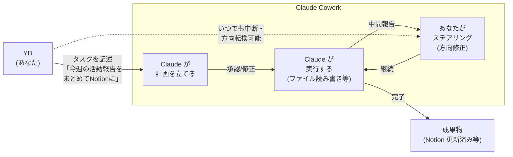

# Claude が自律的に仕事をする仕組み — Cowork 入門

## 1. イントロ・全体像

### Chat と Cowork は何が違うか

Claude の使い方は大きく2種類ある:

| 方法 | 感覚 | 例 |
|------|------|-----|
| **Chat** | 会話 | 「この文章を要約して」→ 即答 |
| **Cowork** | 作業セッション | 「今週の議事録を全部まとめてNotion に上げて」→ Claude が段階的に実行 |

Chat は「相談役」。Cowork は「実際に手を動かす同僚」。

Cowork は Claude デスクトップアプリの1つのタブで動き、PC 上のファイル・フォルダに直接アクセスして実際の成果物を生成する。使用モデルは **Claude Opus 4.7** (最高性能)。

### Cowork タスクループ



---

## 2. 章別解説

### 2.1 コースの全体構成

このコースが教える主要トピック:

1. タスクループ (Cowork の基本サイクル)
2. プラグイン & スキル (機能拡張)
3. スケジュールタスク (自動化)
4. ファイル & リサーチワークフロー
5. パーミッション & モデル選択
6. 責任あるステアリング

---

### 2.2 ファイルシステムアクセス — Coworkの根幹

**承認フォルダ制** でファイルを管理する。

```
セットアップ:
1. 「このフォルダを Cowork に承認する」と設定
2. Claude は承認フォルダ内のファイルを自由に読み書き
3. 承認フォルダ外にはアクセス不可 (安全)

例:
~/projects/salamat-website-v2/ → 承認
→ Claude がこのフォルダのコードを読んで修正し、ファイルを書き戻せる

~/Documents/private/ → 未承認
→ Claude は存在すら知らない
```

**CLAUDE.md で永続的なルールを設定**

承認フォルダの中に `CLAUDE.md` というファイルを置くと、そのフォルダでの全作業に適用されるルールになる。

```markdown
# CLAUDE.md の例 (~/projects/salamat-website-v2/ に置く)

## プロジェクト概要
Salamat 260名サークルの公式サイト。Next.js 16 + React 19 + Tailwind v4。

## ルール
- コードは TypeScript 必須
- コメントは日本語
- Vercel デプロイを想定した設計
- 既存コンポーネントは無闇に変えない

## 禁止事項
- テストなしでの本番デプロイ
- .env ファイルの変更
```

→ 毎回「このプロジェクトは...」と説明しなくてよくなる。Claude Code の CLAUDE.md と同じ概念。

---

### 2.3 タスクループの実践

**初めてのタスク実行**

```
1. Cowork タブを開く
2. タスクを記述する (具体的に)
3. Claude が実行計画を提示 → 確認する
4. 実行中に中間報告が来る → ステアリング
5. 完了 → 成果物を確認
```

**ステアリング (中間修正) が重要**

Chat と大きく違うのは「実行中に方向を変えられる」こと。

```
例:
Claude: 「Notion の今週タスクを更新しました。
         次に、Slack への通知を送ります」
YD: 「Slack には送らないで。代わりに
      Salamat の LINE グループ用のメッセージ文を作って」
→ Claude が方向を変えて継続
```

**うまくいかないパターンと対処**

| 問題 | 原因 | 対処 |
|------|------|------|
| 計画が意図と違う | 記述 (Description) が曖昧 | タスクをより具体的に書き直す |
| 途中で止まった | 権限不足 or エラー | 権限を確認、エラー内容を読む |
| 違う方向に進んでいる | ステアリング不足 | 中間報告時に方向修正を入れる |
| ファイルが消えた | 承認フォルダ設定のミス | バックアップを確認、設定を見直す |

---

### 2.4 プラグイン & スキル

#### プラグイン

Cowork の機能を拡張するアドオン。マーケットプレイスからインストール。

**バーティカルバンドル (業種特化パッケージ)**

| バンドル | 含まれる機能 | 対象プラン |
|---------|------------|----------|
| Small Business | 基本業務自動化スキル群 | Pro |
| Marketing Ops | SNS・コンテンツ・広告関連 | Pro |
| Legal | 文書レビュー・要約 (弁護士監督必須) | Team |

現時点で <200 のプラグイン (OpenAI GPT の 3M+ と比較して少ない)。成熟途上。

#### スキル

「再利用可能な命令セット」。Claude 101 の Skills と同じ概念の Cowork 版。

```
例: 「週次報告スキル」
内容:
  1. 今週の活動ログを ~/ObsidianVault/log.md から読む
  2. プロジェクト別に整理する
  3. Markdown 形式でサマリを生成する
  4. ~/ObsidianVault/sessions/ に保存する
  
使い方: スキルをクリック → 実行 → 完了
```

---

### 2.5 スケジュールタスク

「繰り返し同じことをしなければいけない」仕事を Claude に任せる機能。

```
例:
「毎月曜の朝9時に、先週の ai-researcher の収集記事を
 カテゴリ別にまとめて Vault の weekly_digest.md に書いて」
→ 一度設定すれば毎週自動実行
```

**スケジュールタスク vs Cloud Routines**

| | Scheduled Tasks | Cloud Routines |
|--|----------------|----------------|
| 実行場所 | ローカル (Mac上) | クラウド |
| Mac が必要か | ✅ 必要 | ❌ 不要 |
| 現状 | 正式リリース | リサーチプレビュー |

YD のユースケース: morning-briefing (既に cron で実装済み) の代替候補として将来的に検討価値あり。

---

### 2.6 Live Artifacts & Dispatch

#### Live Artifacts

Cowork で生成したチャート・ダッシュボード・ドキュメントが「ファイルとして常に最新」の状態で維持される機能。

```
例:
Salamat メンバー数の推移グラフ → Live Artifact として保存
→ 毎月メンバーデータを更新すると、グラフが自動更新
→ 「このグラフを報告書に貼り付ければ常に最新」
```

#### Dispatch (Computer Use)

Claude が実際にアプリを操作する機能。

```
できること:
- ブラウザで URL を開く
- ボタンをクリック
- フォームに入力
- スクリーンショットを撮る

使いどき: API がないシステムの操作
制限: 人間のクリックより遅い、間違えることもある
```

---

### 2.7 責任あるステアリング

Cowork は「Claude が自律的に実行する」ため、Chat より Diligence (勤勉) が重要。

**注意すべきポイント**

```
1. 実行前に計画を必ず確認する
   → 「Step 3 で Notion のページを削除する」と書いてあったら止める

2. 重要なファイルのバックアップを先に取る
   → Claude が間違えた場合に戻せる準備をする

3. 段階的に権限を与える
   → いきなり大量のフォルダを承認しない
   → 小さいタスクから試して信頼性を確認する

4. Hallucination は Cowork でも起きる (~1%)
   → Cowork が書いたコードや文書も Discernment は必須
```

---

## 3. YDのコンテキストへの応用

### Salamat 週次レポートの自動化

```
Cowork タスク:
「~/ObsidianVault/log.md から今週 (5/20-5/26) の
 Salamat 関連の作業ログを抽出して、
 活動報告メール (代表 → メンバー向け、300字以内) を
 ~/projects/salamat-weekly/ に report_2026-W21.md として保存して」

スケジュール化: 毎週日曜21:00に自動実行
効果: 毎週の報告書作成時間 0分化
```

### Lecture Hub ドキュメント処理

```
Cowork タスク:
「~/Downloads/講義資料/ 内の PDF を全件読み込んで、
 各ファイルごとに以下を生成:
 - タイトル、日付、キーワード5個 (frontmatter)
 - 要点 (500字以内)
 - アクションアイテム (あれば)
 → ~/ObsidianVault/knowledge/lecture_notes/<ファイル名>.md に保存」

効果: 講義PDFの山を一括でVaultに構造化取り込み
```

### ai-researcher と連携したリサーチ

```
現状: ai-researcher が毎時記事を収集 → ~/ObsidianVault/raw/research/
Cowork タスク (将来):
「今日の ~/ObsidianVault/raw/research/2026-05-20/ の記事を
 AIエンジニアリング / Salamat / Arte Grow の3カテゴリに分類して
 それぞれ ~/ObsidianVault/knowledge/ の対応フォルダに振り分けて」

→ ai-researcher (収集) + Cowork (分類・整理) のパイプライン化
```

### vidkit との組み合わせ

```
CLAUDE.md (~/projects/vidkit/ に置く):
「vidkit は Python の動画前処理 CLI。
 モード: dance / autocut / tighten / tutorial / lecture
 lecture モードは pyannote HF_TOKEN 待ち (未実装)。
 変更時は必ず tests/ を実行して確認する。
 コミット前に README.md も更新すること。」

→ Cowork から vidkit を操作するときのコンテキスト自動適用
```

---

## 4. チートシート

```
┌──────────────────────────────────────────────────────────┐
│  Claude Cowork クイックリファレンス                       │
├──────────────────────┬───────────────────────────────────┤
│ 概念                 │ 一言説明                          │
├──────────────────────┼───────────────────────────────────┤
│ Cowork               │ Chat の上位互換。ファイルを実際に  │
│                      │ 読み書きする作業モード。           │
│ タスクループ         │ 記述→計画→実行→ステアリング→完了  │
│ 承認フォルダ         │ Claude がアクセスできるフォルダを  │
│                      │ 明示的に指定する (安全設計)        │
│ CLAUDE.md            │ フォルダ内の永続ルール。            │
│                      │ 毎回説明しなくていい。              │
│ スケジュールタスク   │ 定期自動実行。ローカル実行のみ。    │
│ Cloud Routines       │ クラウド実行 (プレビュー中)。       │
│                      │ Mac 閉じてても動く。               │
│ Dispatch             │ AI がアプリを直接操作 (Computer Use)│
│ Live Artifacts       │ 常に最新状態を維持する出力ファイル │
└──────────────────────┴───────────────────────────────────┘

価格: Pro $20/月 → Team $25/席 → Enterprise カスタム
欠けているコネクタ: Salesforce / Shopify / NetSuite / Zoho
```

---

## 5. 修了試験対策

**Q: Chat モードと Cowork モードの本質的な違いは?**
A: Chat は会話 (テキスト応答)。Cowork はタスク実行 (ファイル読み書き、外部サービス操作、スケジュール実行)。Cowork は成果物が実際にディスクに生成される。

**Q: Cowork の「タスクループ」とは?**
A: 記述 (describe) → 計画 (plan) → 実行 (execute) → ステアリング (steer) のサイクル。途中でユーザーが方向修正できる点が重要。

**Q: 承認フォルダ制とは何か、なぜ必要か?**
A: Cowork が読み書きできるフォルダをユーザーが明示的に指定する仕組み。これにより Claude が意図しないファイルにアクセスするリスクを防ぐ。

**Q: CLAUDE.md の役割は?**
A: 承認フォルダ内に置くファイルで、そのフォルダでの全 Cowork セッションに適用される永続的なルール。毎回コンテキストを説明しなくていい。

**Q: Scheduled Tasks と Cloud Routines の違いは?**
A: Scheduled Tasks はローカル (Mac が開いている必要あり)。Cloud Routines はクラウドで実行するため Mac が閉じていても動く (2026年時点でリサーチプレビュー)。

**Q: Dispatch (Computer Use) が有効なユースケースは?**
A: API を持たない Web サービスやアプリを Claude が自動操作する必要があるとき。例: フォーム入力が必要な古いシステム、スクリーンショット取得など。

**Q: Cowork の責任あるステアリングで最重要なことは?**
A: 実行前に Claude の計画を確認すること。重要なファイルは事前にバックアップを取ること。Claude の出力も Discernment (識別) が必要。

---

## 6. 関連リンク

| 種別 | リンク | メモ |
|------|--------|------|
| 公式コース | https://anthropic.skilljar.com/introduction-to-claude-cowork | Anthropic Academy |
| Cowork 公式 | https://www.anthropic.com/product/claude-cowork | 製品ページ |
| 前提コース | [[04_claude_101]] | Chat/Cowork/Code の基礎 |
| Cowork vs ループ | https://buildtolaunch.substack.com/p/claude-cowork-scheduled-tasks-vs-routines-vs-loop | Scheduled vs Routines vs /loop |
| Vault 連携 | `~/ObsidianVault/current_state/tools_available.md` | 環境別ツール一覧 |
| 関連プロジェクト | `~/projects/morning-briefing/` | cron実装 (Coworkスケジュールの先行実装) |

---

## 7. 必須3セクション

### ✅ うまく行ったこと

- 「Chat は会話、Cowork は作業セッション」という対比が核心を一発で伝えられる
- タスクループ (記述→計画→実行→ステアリング) という概念が、YDの既存プロジェクト (ai-researcher の毎時収集パイプライン、morning-briefing のcron化) と構造的に一致していて理解しやすい
- CLAUDE.md の概念は Claude Code の CLAUDE.md とまったく同じ概念なので、既に使っているYDには即理解できる

### ❌ 詰まったこと

- Cowork の全機能 (Dispatch / Live Artifacts / Cloud Routines) は2026年初頭時点で「正式リリース」「プレビュー」「計画中」が混在しており、コース内容と実際に使える機能が微妙にずれる可能性がある
- Scheduled Tasks は「Mac が開いている必要がある」という制約が実際に使うと不便。cron と何が違うのかを理解してからの方がよい
- プラグインマーケットが <200件と少ないため、期待していたプラグインがない可能性がある
- Hallucination ~1% という数字が「ファイルを書き戻す実行時」に起きると実害が大きい (ファイル内容が変わる) ので、重要ファイルのバックアップが必須

### 📋 次回チェックリスト (コース受講時)

- [ ] 受講前: 承認フォルダとして使いたいフォルダを1つ決めておく (小さいプロジェクトで試す)
- [ ] 受講前: そのフォルダの重要ファイルをバックアップしておく
- [ ] Module 1 受講中: Cowork タブを開いて最初のタスクを実際に実行してみる
- [ ] CLAUDE.md: ~/projects/ の中の1つのプロジェクトに試験的に作成する
- [ ] スケジュールタスク: 週1回の繰り返し作業を1つ選んで自動化してみる
- [ ] コース後: morning-briefing (既存 cron) と Cowork スケジュールタスクを比較して、移行するか判断する
- [ ] Dispatch: 実際に試してみる (フォーム入力系のユースケースで)
