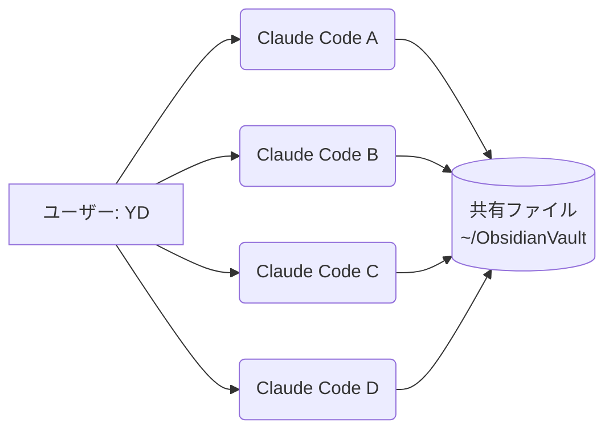

<!--
=================================================================
YD専用教科書 統一テンプレート

書き方ルール:
- 専門用語は初出時に必ず注釈をつける (用語集でなく本文でも)
- 図解 (Mermaid) を必ず1つ以上入れる
- 実コード + 日本語コメントで再現性を担保
- A4 8-12ページ目安 (= 約4,000-7,000 文字)
- 「動くもの」より「本物のクオリティ」 (見出し階層は深くしすぎない)

セクションは原則7つ:
  1. 何が起きた?    (実例で掴ませる)
  2. 図解            (Mermaid)
  3. キーコンセプト  (3-5個)
  4. コード解説      (実コード + 日本語コメント)
  5. 次やる時のチェックリスト
  6. 関連リンク
  7. 用語集

不要なセクションは省いて良いが、図解と用語集は必須。
=================================================================
-->

# ここに教材タイトル (h1)

## 1. 何が起きた?

ここでまず**具体的なシーン**から入る。
抽象論ではなく、YDの実生活で起きた「あの困った」「あの不思議」を提示する。

例: 「2026-05-19の朝、Macで4つのClaude Codeが同時に動いていた。
     画面が4分割されて、どれが何をやってるのか分からなくなった。」

書き方のコツ:
- 主語と動作主を明確に
- 数字や時刻を入れる
- 「だから何が分からないか」を最後の1文に置く

---

## 2. 図解

ここで頭に絵を貼り付ける。Mermaid は ` ```mermaid ` ブロックで書く。



図の下に1〜2行のキャプションを書くと親切。
> *4つのセッションは同じVaultに同時アクセスする。これが「並列」の正体。*

---

## 3. キーコンセプト

ここで本文の幹を3〜5個に絞って提示する。各概念は2-3行で。

### 3.1 概念A

概念Aの説明。難語は使わない。比喩を入れる。

### 3.2 概念B

概念Bの説明。

### 3.3 概念C

概念Cの説明。

---

## 4. コード解説

実際に動くコードを見せる。コメントは日本語で。

```bash
# ターミナル: ホームディレクトリで Claude Code を1つ起動する
cd ~                       # ホームに移動
claude                     # Claude Code CLI を起動
```

```python
# Python: ファイルを開いて中身を読む
from pathlib import Path

vault = Path.home() / "ObsidianVault"   # ~/ObsidianVault のパス
log = vault / "log.md"                   # その中の log.md
print(log.read_text(encoding="utf-8"))   # 中身を画面に出す
```

コードのすぐ後に「ここで何が起きてるか」を1段落で説明する。

---

## 5. 次やる時のチェックリスト

「自分が次に再現するとき」「他人に教えるとき」迷わない順序で。

- [ ] **準備**: ターミナル開く / Claude Code 入ってる確認
- [ ] **Step 1**: ○○ を実行
- [ ] **Step 2**: ××× を確認 (失敗したら△△を疑う)
- [ ] **Step 3**: 結果が□□になる
- [ ] **片付け**: ○○を閉じる

「最初に詰まりがちなポイント」も列挙する:
- ❌ よくある失敗: △△
- ✅ 防ぎ方: △△の前に××を確認する

---

## 6. 関連リンク

| 種別 | リンク | メモ |
|------|--------|------|
| 公式 | https://example.com | 必読 |
| 教材 | [[02_xxx]] | 本Vault内の関連教材 |
| 動画 | https://youtube.com/... | YDが見たやつ |

---

## 7. 用語集

| 用語 | 意味 |
|------|------|
| **Claude Code** | Anthropic公式のターミナル用AI開発ツール。`claude` コマンドで起動する。 |
| **CLI** | Command Line Interface の略。黒い画面 (=ターミナル) で文字を打ってコンピュータを動かすやり方。 |
| **cron** | Macに最初から入っている「決まった時刻に何かを実行する」仕組み。 |
| **git** | コードの変更を追跡するツール。「いつ何を変えたか」を全部覚えている。 |
| **リポジトリ** | gitが管理するプロジェクトフォルダ1つの単位。略して「リポ」。 |
| **branch (ブランチ)** | リポジトリの中の「並行宇宙」。本流を壊さずに試せる作業領域。 |
| **commit (コミット)** | 変更を「ここまでをセーブする」操作。スナップショットを残す。 |
| **push (プッシュ)** | ローカルのコミットをGitHubなどのリモートに送る操作。 |

---

<!-- 必須3セクション (Vault 規約。教材本体には不要、knowledge ファイル限定) -->
<!-- 教材自体はこの3セクションは不要 -->
